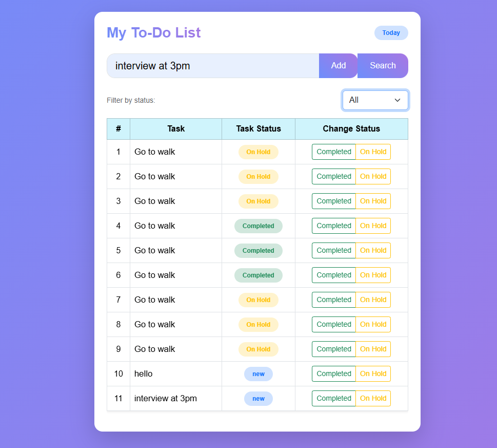
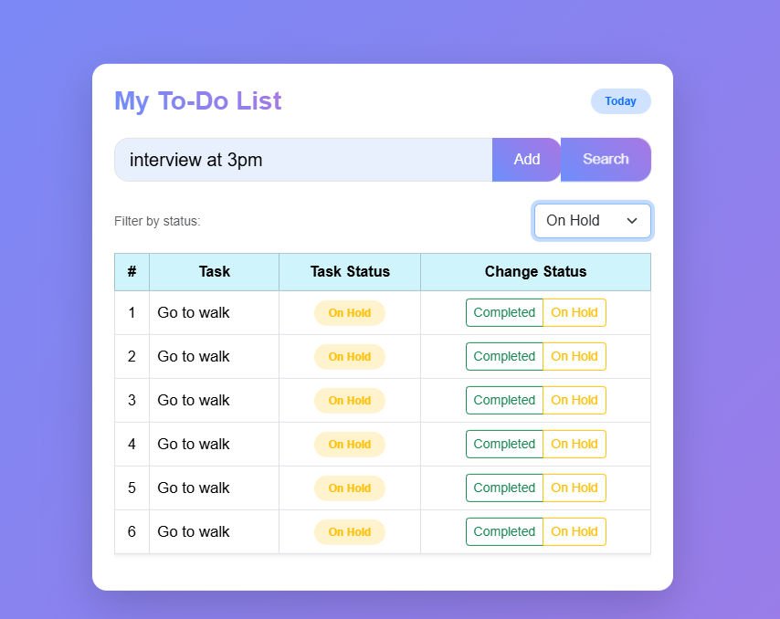

# 📝 Angular To-Do App
```
A simple and elegant **To-Do List Application** built with **Angular**.  
This project allows users to add, view, filter, and manage daily tasks with  local storage persistence.

---

## 🚀 Features

- ✅ Add new tasks  
- 🗂️ Filter tasks (All, Completed, On Hold)  
- 🔄 Update task status dynamically  
- 🧩 Local Storage support (data saved even after refresh)  
- 💅 Built with Bootstrap 5 & modern color themes  
- ✨ Smooth animations for better UX  

---

## 🧠 Tech Stack

- **Frontend:** Angular 20.3.4
- **UI Framework:** Bootstrap 5  
- **Language:** TypeScript  
- **Storage:** Local Storage  

---

## 📦 Installation & Setup

1. **Clone the repository**
bash
    git clone https://github.com/<your-username>/angular-todo-app.git
   
Navigate into the folder

bash
cd angular-todo-app

👉 Install dependencies

bash
npm install

👉Run the development server

bash
ng serve

Open your browser and visit:
👉 http://localhost:4200

📸 Preview
```
```
To Do App

```


```
Filter:Completed

```


```
Filter:On hold

```
.png) 

💡 Future Improvements
Add due dates & reminders

Integrate with Firebase for real-time sync

Dark mode toggle

Task categories and priorities


